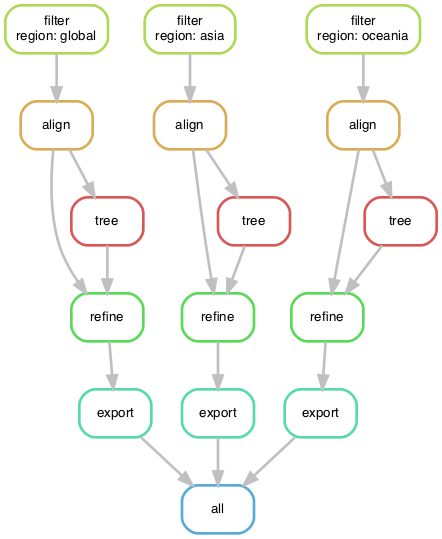

# Example Nextstrain workflow with public SARS-CoV-2 sequences

A demonstration of how to migrate commands for a Nextstrain build from a simple bash shell script to a Snakemake workflow that supports regions-specific builds and user configuration.

## Quickstart

[Install miniconda](https://docs.conda.io/en/latest/miniconda.html).
Create an environment to test this Nextstrain workflow.

```bash
conda env create -n nextstrain-workflow -f envs/nextstrain.yaml
```

Activate the environment to use the workflow.

```bash

conda activate nextstrain-workflow
```

Run the workflow with defaults.

```bash
snakemake --cores 4
```

## Resources

  - [Snakemake documentation](http://snakemake.readthedocs.io/)
  - [Carpentries workshop on analysis pipelines with Python](https://hpc-carpentry.github.io/hpc-python/)
  - [Nextstrain documentation](https://nextstrain.org/docs)

## Background on Snakemake

Snakemake a domain-specific language (DSL) is written in Python.
A Snakemake workflow consists of one or more rules that run commands.
Snakemake translates rules in the DSL into Python behind the scenes.
You can write standard Python code almost anywhere in a Snakefile.

## Background on YAML format

[YAML](https://yaml.org/start.html) is a standard configuration file format that supports lists, dictionaries, and scalar data types like strings, floats, and integers.
Snakemake supports (and seems to prefer) YAML for its own configuration.

## Standard directory structure of a Snakemake workflow

The Snakemake documentation recommends a standard directory structure for its workflows.
The best example, however, is a [working workflow for variant calling from DNA sequences](https://github.com/snakemake-workflows/dna-seq-gatk-variant-calling).
This repository consists of:

  - Snakefile
  - rules/
    - common.smk (for example)
  - config/
    - config.yaml

## Premise for this example workflow

This workflow shows how to create region-specific phylogenies for SARS-CoV-2 for visualization in auspice (or [auspice.us][]).
The workflow includes steps to:

  1. Filter sequences and metadata
  1. Align sequences relative to a reference
  1. Infer a phylogeny
  1. Build a time tree
  1. Export the time tree to JSON(s) to visualize in auspice

In the end, we want to create a "global" build that includes sequences from all regions and multiple "region" builds that includes only sequences from specific regions.

## Walking through the workflow

### Start with a shell script

The bash shell script `builds.sh` includes all the augur commands necessary to process and analyze the data in the steps listed above.
Run this script to run each command in order and produce a single `auspice/global.json` to view in auspice.us.

```bash
bash builds.sh
```

This script is all you need to create a single "global" Nextstrain build.

### Use a Snakefile to implement the same commands with Snakemake

Checkout the tag `basic-workflow` to see the simplest Snakefile that will produce the same outputs as the shell script above.

```bash
git checkout basic-workflow
```

Open `Snakefile` with your favorite text editor, to see how the shell script translates to a Snakemake workflow.

```bash
less Snakefile
```

### How to understand what Snakemake will do

Before you run any workflow, it is a good idea to confirm what Snakemake thinks it will do.
In the best case, Snakemake will only run the rules it needs to create the final output files specified by the `all` rule.
In the worst case, Snakemake will re-run your entire workflow from scratch and destroy all the outputs that already existed and took so long to create.

Snakemake includes several tools to interrogate the workflow both before and after you run it.
The simplest way to inspect the workflow is to look at the `Snakefile`.
This approach becomes less reliable as workflows become more complicated.

The next simplest way to inspect the workflow is to do a "dry run" and print all the commands that will executed.

```bash
snakemake --dryrun --printshellcmds
```

Combine these flags into their abbreviated flags like so.

```bash
snakemake -np
```

You can also ask Snakemake to produce a tabular summary of all the rules it will run.

```bash
snakemake --summary
```

Or you can ask for a more detailed summary that includes the specific commands that will be run.
Here, you need to specify how many cores you want to run the workflow with.

```bash
snakemake --detailed-summary --cores 4
```

You can visualize the directed acyclic graph (DAG) that Snakemake builds for the workflow.
This DAG describes the flow of data from the first input files to the final output files.

```bash
snakemake --forceall --dag | dot -Tpdf > dag.pdf
```

If the command above doesn't work for you, export the DAG in plain text to your screen and copy and paste it into a web graph viewer like http://www.webgraphviz.com/.

```bash
snakemake --forceall --dag
```


From this graph, we see that Snakemake will start with the `filter` rule and run through to the auspice `export` rule.
The `all` rule always aggregates all the final outputs, so this will usually be your final output of the graph.
This graph also reveals that the output of the `align` rule is used twice.
This is a fact that you could easily miss while scanning the source code or the print statements from the dry run.

Finally, you can generate a report of how your workflow will run or did run.
Before you run the workflow, the report will provide a cleaner D3 view of the DAG.

```bash
snakemake --report report.html
```

After you run the workflow, the report will include statistics about how long each rule took to run, what the configuration for the run was, and any other report details you include in the Snakefile.
We won't cover how to build reports here, but they are worth looking into.

### Abstract hardcoded values into parameters

The simplest Snakefile hardcodes values like the minimum sequence length and number of sequences to group by into the shell commands of each rule.
When we want to change these values in the future, we need to remember to look for them in the appropriate shell commands.
To increase the visibility of these values, we can move them into a `params` directive for each rule, as needed.
These changes also allow Snakemake to track the values of these parameters across different runs of the workflow.
For example, the following command lists all rules whose parameter values have changed since the last run.

```bash
snakemake --list-params-changes
```

The simple Snakefile also hardcodes the number of threads used by the alignment and tree building rules.
If we specify these resources in the Snakemake `threads` directive, we expose these values to Snakemake and get more control over them at run time.
To see how the workflow with parameters has changed, run the following git diff command.

```bash
git diff basic-workflow workflow-with-params
```

Switch to the workflow with params by checking out the corresponding tag.

```bash
git checkout workflow-with-params
```

Inspect `Snakefile` with your text editor to see how parameters work in context of the full workflow.

Print the commands for the workflow to see how they have changed.
Notice that, by default, the align and tree rules only use **1** thread.
This is because we haven't specified how many cores to use.

```bash
snakemake -np --forceall
```

Print commands with a request for four cores.
Now the align and tree rules will use the expected number of threads.

```bash
snakemake -np --forceall --cores 4
```

You can also ask Snakemake to change the number of threads per rule at run time.
For example, the following command asks to run the workflow with 2 threads per alignment rule.

```bash
snakemake -np --forceall --cores 4 --set-threads align=2
```

### Define parameters with a configuration file

The `params` directive exposes parameter values to Snakemake and to us as the authors of the workflow.
Any users of our workflow who want to change these values will need to edit the `Snakefile` and know enough about Snakemake to make these changes confidently.
We can make life easier for other users and ourselves, by defining these parameter values in a configuration file.

Create a new file named `config/config.yaml` and add existing parameters to this file.
For example, the filter parameters could be defined as follows.

```yaml
min_length: 25000
group_by: region year month
sequences_per_group: 10
```

Next, add a `configfile` directive to the `Snakefile` to let Snakemake know where to find the configuration file.
Finally, replace the hardcoded values in the `params` directives with corresponding references to the `config` dictionary.

To see how the workflow has changed, inspect the difference between the workflow with parameters and with a config file.

```bash
git diff workflow-with-params workflow-with-config
```

To see how the workflow looks with a configuration file, check out the corresponding tag.

```bash
git checkout workflow-with-config
```

Inspect `Snakefile` with your text editor to see how parameters work in context of the full workflow.

Print the workflow commands with a dry run to see how the configuration file has changed the commands.

```bash
snakemake -np
```

Now that parameters are in the configuration file, you can override them from the command line, as needed.
Inspect the command for the `filter` rule print by the command below to confirm that you've changed the parameter.

```bash
snakemake -np --config min_length=29000
```

Now users of the workflow only need to know how to edit a YAML file to change parameters.
They no longer need to have detailed knowledge of Snakemake's DSL.

### How can we improve our workflow?

At this point, we've defined a simple workflow, abstracted hardcoded values into parameters, and exposed those parameters in a configuration file.
Is there anyway we can improve our workflow?
More recent versions of Snakemake provide a "linting" tool that inspects the workflow and lists ways it could be improved.
These checks are Snakemake's equivalent of Python's "PEP8" coding standards; they are guidelines that can improve the readability and accuracy of your code, but they are not mandatory.

Run Snakemake's linter to see how we can improve the `workflow-with-config` workflow.

```bash
snakemake --lint
```

The output tells us that we could generally improve the workflow by adding logging and specifying conda environments for each rule.
These are great suggestions, so let's do it!

### Logging output from commands

When we run the current workflow, all output from augur commands gets written to our screen.
If something goes wrong or if relevant information is printed, we will lose it when we close our session.
One way to safely store output from commands that we run is to write them out to a log file.
Snakemake supports a `log` directive that allows us to specify a log file name for each rule.

Let's add a `log` directive for each rule and write all output from standard out (stdout) and standard error (stderr) to a single file.
To see how the workflow has changed, inspect the difference between the workflow with a config file and with logging.

```bash
git diff workflow-with-config workflow-with-logging
```

To see how the workflow looks with logging, check out the corresponding tag.

```bash
git checkout workflow-with-logging
```

### Run rules in a custom conda environment

We happen to be running the above commands in an environment that already has mafft, iqtree, and augur installed.
Most people who download this workflow for the first time will not have an environment configured or may not wish to.
Snakemake supports defining conda environments per rule allowing us to control which software is available to each rule.
These environments are stored with the workflow and are updated automatically whenever their corresponding YAML files change.

Create a new directory called `envs` and create a new YAML file named `envs/nextstrain.yaml` with the following contents.

```yaml
channels:
  - default
  - bioconda
dependencies:
  - pip
  - mafft
  - iqtree
  - pip:
      - git+https://github.com/nextstrain/augur.git@master
```

Next, tell Snakemake which rules should use this environment by adding a `conda` directive to each rule.
We will add this directive to all rules except the `all` rule.

To see how the workflow has changed, inspect the difference between the workflow with logging and with conda environments.

```bash
git diff workflow-with-logging workflow-with-conda
```

To see how the workflow looks with conda environments, check out the corresponding tag.

```bash
git checkout workflow-with-conda
```

Run the workflow with conda environments per rule.
The first time you run the workflow with this new flag, Snakemake will download and install the packages in each environment you defined.
(This can take a while.)

```bash
snakemake --cores 4 --use-conda
```

Check the workflow with Snakemake's linter again.

```bash
snakemake --lint
```

Everything should look good!

### Reuse rules with wildcards

The current workflow creates a single "global" build for SARS-CoV-2 sequences, but ideally we'd like to also create multiple separate builds per major geographic region (e.g., Asia, Europe, etc.).
How can we reuse our current `Snakefile` to support multiple regions without duplicating rules?

One approach is to consider how we would want our output to be organized in an ideal world.
For example, an Oceania build should produce a final JSON named `auspice/oceania.json` and its intermediate outputs should be stored in `results/oceania/`.
Let's change the inputs and outputs of the current workflow to follow this exact pattern for the region "oceania".
We also need to update the `filter` rule to only select sequences from "Oceania".

Now that we have the general format we'd like for our region-specific builds, we can replace the hardcoded name "oceania" in all our paths with a variable.
This variable will allow us to ask for a build by any name and Snakemake will reuse our existing rules to produce the correct output.
Snakemake calls these variables "wildcards".
Replace "oceania" with a `{region}` wildcard and confirm that we can request builds for different regions.

```bash
# Try a build for Asia
snakemake -np auspice/asia.json

# Or try a build for Oceania
snakemake -np auspice/oceania.json
```

The output for the Asian build still uses a `filter` query for "Oceania".
Add a function to support looking up the human-readable name of a region by its wildcard value.
Add a mapping of short region name to human-readable name to the configuration file to make the above function work.
This code is an example of the power and potential complexity of wildcards.

Before we move on, let's check the linter again.

```bash
snakemake --lint
```

The linter doesn't like the mixture of functions and rules in a single file.
Again, the linter only provides recommendations, but in this case the suggestion will improve the readability of our workflow.

Create a new directory called `rules` and create a new file named `rules/common.smk`.
Move the function(s) for region names into this new file.

Finally, let's update the configuration file to include a list of all of the regions we'd like builds for.
Use the `expand` function in the `all` rule to automatically build a list of desired outputs from the list of regions in the configuration file.

To see how the workflow has changed, inspect the difference between the workflow with conda environments and with wildcards.

```bash
git diff workflow-with-conda workflow-with-wildcards
```

To see how the workflow looks with conda environments, check out the corresponding tag.

```bash
git checkout workflow-with-wildcards
```

Confirm that the workflow will run multiple region builds with one command.

```bash
snakemake -np
```

### Use conditional logic to control the flow of data

Wildcards allow us to reuse a few simple Snakemake rules to produce as many regional builds as we like.
However, we have lost our "global" build in the process, because we have a single filter rule that always filters by a given region.
Let's add the "global" name to our list of regions and modify the `filter` rule to make the region query optional.

Add a new function `_get_query_argument_by_wildcards` to `rules/common.smk` that checks the value of a given region wildcard.
If the wildcard value is "global", do not return a query argument.
Otherwise, return the query argument used for each region.
With this approach, we use conditional logic in pure Python and Snakemake's wildcards to control how a command is executed in a data-dependent manner.
Note that there are many different ways to accomplish the same outcome here.
The approach you choose depends on the context of the rest of the workflow.

To see how the workflow has changed, inspect the difference between the workflow with wildcards and with conditional logic.

```bash
git diff workflow-with-wildcards workflow-with-conditional-logic
```

To see how the workflow looks with conditional logic, check out the corresponding tag.

```bash
git checkout workflow-with-conditional-logic
```

Confirm that the `filter` commands for the global build will be different than those of the other regional builds.

```bash
snakemake -np
```

Before we run the workflow, inspect the DAG again, to see how it has changed.

```bash
snakemake --forceall --dag | dot -Tpdf > dag.pdf
```



Try running the entire workflow with conda environments and all regional builds.

```bash
snakemake --cores 4 --use-conda --set-threads align=2 --printshellcmds
```

We can now produce multiple regional builds with custom filter logic in parallel.
This workflow has come a long way from the initial shell script!

### Define your preferred Snakemake commands with a profile

Even though the workflow has come a long way, the command to run the workflow has gotten a lot longer, too.
It is easy to forget which flags and arguments you prefer to use.
When you start to distribute your workflows in a high performance computing environment, tracking these arguments is basically impossible.
Snakemake tries to address this problem with "profiles".

A profile is a yet another YAML config file that defines the arguments to include when you run Snakemake.
To see how this works, create a new directory called `profiles` and a subdirectory called `profiles/default`.

```bash
mkdir -p profiles/default
```

Create a new file named `profiles/default/config.yaml` and add the following lines to it.

```yaml
cores: 4
printshellcmds: True
set-threads: align=2
use-conda: True
```

Now, we can replace the longer Snakemake command from above with the following command.

```bash
snakemake --profile profiles/default
```

To see how the workflow has changed, inspect the difference between the workflow with conditional logic and with profiles.

```bash
git diff workflow-with-conditional-logic workflow-with-profile
```

To see how the workflow looks with a profile, check out the corresponding tag.
Note that this version of the repository defines a custom profile for my username in `profiles/huddlej/`.

```bash
git checkout workflow-with-profile
```

## Conclusions

This walkthrough showed one example of how to convert a simple Nextstrain workflow from a bash shell script to a multi-region workflow that can be easily configured by users and run in parallel with locally or in a distributed environment.
The current Nextstrain workflow for SARS-CoV-2 is much more complicated than the example shown here, but many of the principles described here are applied in the full workflow.
For more details, check out [the guide on how to run the SARS-CoV-2 build for Nextstrain](https://github.com/nextstrain/ncov/blob/master/docs/running.md).

[auspice.us]: https://auspice-us.herokuapp.com/
