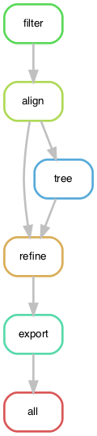

# Example Nextstrain workflow with public SARS-CoV-2 sequences

A demonstration of how to migrate commands for a Nextstrain build from a simple bash shell script to a Snakemake workflow that supports regions-specific builds and user configuration.

## Quickstart

[Install miniconda](https://docs.conda.io/en/latest/miniconda.html).
Create an environment to test this Nextstrain workflow.

```bash
conda env create -n nextstrain-workflow -f envs/nextstrain.yaml
```

Activate the environment to use the workflow.

```bash

conda activate nextstrain-workflow
```

Run the workflow with defaults.

```bash
snakemake --cores 4
```

## Resources

  - [Snakemake documentation](http://snakemake.readthedocs.io/)
  - [Carpentries workshop on analysis pipelines with Python](https://hpc-carpentry.github.io/hpc-python/)
  - [Nextstrain documentation](https://nextstrain.org/docs)

## Background on Snakemake

Snakemake a domain-specific language (DSL) is written in Python.
A Snakemake workflow consists of one or more rules that run commands.
Snakemake translates rules in the DSL into Python behind the scenes.
You can write standard Python code almost anywhere in a Snakefile.

## Background on YAML format

[YAML](https://yaml.org/start.html) is a standard configuration file format that supports lists, dictionaries, and scalar data types like strings, floats, and integers.
Snakemake supports (and seems to prefer) YAML for its own configuration.

## Standard directory structure of a Snakemake workflow

The Snakemake documentation recommends a standard directory structure for its workflows.
The best example, however, is a [working workflow for variant calling from DNA sequences](https://github.com/snakemake-workflows/dna-seq-gatk-variant-calling).
This repository consists of:

  - Snakefile
  - rules/
    - common.smk (for example)
  - config/
    - config.yaml

## Premise for this example workflow

This workflow shows how to create region-specific phylogenies for SARS-CoV-2 for visualization in auspice (or [auspice.us][]).
The workflow includes steps to:

  1. Filter sequences and metadata
  1. Align sequences relative to a reference
  1. Infer a phylogeny
  1. Build a time tree
  1. Export the time tree to JSON(s) to visualize in auspice

In the end, we want to create a "global" build that includes sequences from all regions and multiple "region" builds that includes only sequences from specific regions.

## Walking through the workflow

### Start with a shell script

The bash shell script `builds.sh` includes all the augur commands necessary to process and analyze the data in the steps listed above.
Run this script to run each command in order and produce a single `auspice/global.json` to view in auspice.us.

```bash
bash builds.sh
```

This script is all you need to create a single "global" Nextstrain build.

### Use a Snakefile to implement the same commands with Snakemake

Checkout the tag `basic-workflow` to see the simplest Snakefile that will produce the same outputs as the shell script above.

```bash
git checkout basic-workflow
```

Open `Snakefile` with your favorite text editor, to see how the shell script translates to a Snakemake workflow.

```bash
less Snakefile
```

### How to understand what Snakemake will do

Before you run any workflow, it is a good idea to confirm what Snakemake thinks it will do.
In the best case, Snakemake will only run the rules it needs to create the final output files specified by the `all` rule.
In the worst case, Snakemake will re-run your entire workflow from scratch and destroy all the outputs that already existed and took so long to create.

Snakemake includes several tools to interrogate the workflow both before and after you run it.
The simplest way to inspect the workflow is to look at the `Snakefile`.
This approach becomes less reliable as workflows become more complicated.

The next simplest way to inspect the workflow is to do a "dry-run" and print all the commands that will executed.

```bash
snakemake --dryrun --printshellcmds
```

Combine these flags into their abbreviated flags like so.

```bash
snakemake -np
```

You can also ask Snakemake to produce a tabular summary of all the rules it will run.

```bash
snakemake --summary
```

Or you can ask for a more detailed summary that includes the specific commands that will be run.
Here, you need to specify how many cores you want to run the workflow with.

```bash
snakemake --detailed-summary --cores 4
```

You can visualize the directed acyclic graph (DAG) that Snakemake builds for the workflow.
This DAG describes the flow of data from the first input files to the final output files.

```bash
snakemake --forceall --dag | dot -Tpdf > dag.pdf
```

If the command above doesn't work for you, export the DAG in plain text to your screen and copy and paste it into a web graph viewer like http://www.webgraphviz.com/.

```bash
snakemake --forceall --dag
```



From this graph, we see that Snakemake will start with the `filter` rule and run through to the auspice `export` rule.
The `all` rule always aggregates all the final outputs, so this will usually be your final output of the graph.
This graph also reveals that the output of the `align` rule is used twice.
This is a fact that you could easily miss while scanning the source code or the print statements from the dryrun.

Finally, you can generate a report of how your workflow will run or did run.
Before you run the workflow, the report will provide a cleaner D3 view of the DAG.

```bash
snakemake --report report.html
```

After you run the workflow, the report will include statistics about how long each rule took to run, what the configuration for the run was, and any other report details you include in the Snakefile.
We won't cover how to build reports here, but they are worth looking into.


[auspice.us]: https://auspice-us.herokuapp.com/
